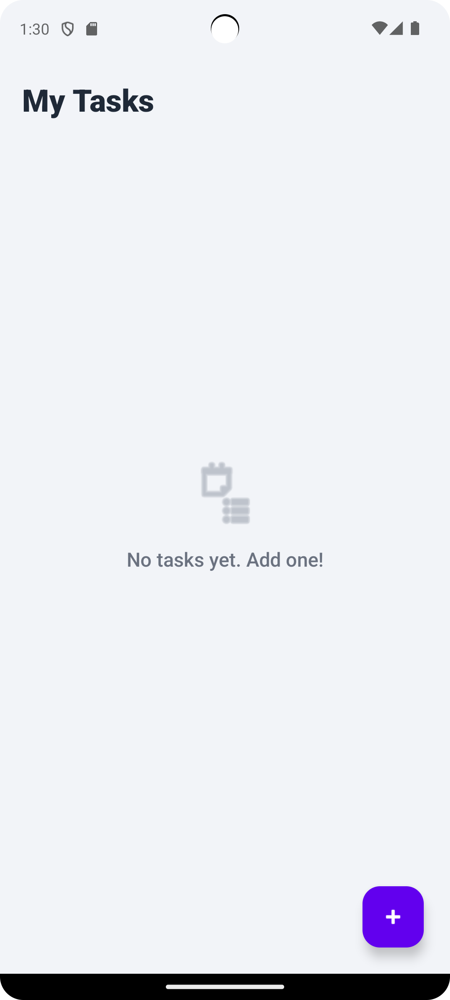
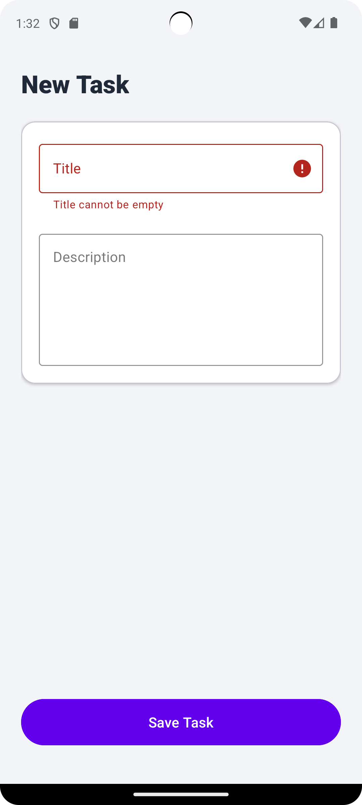
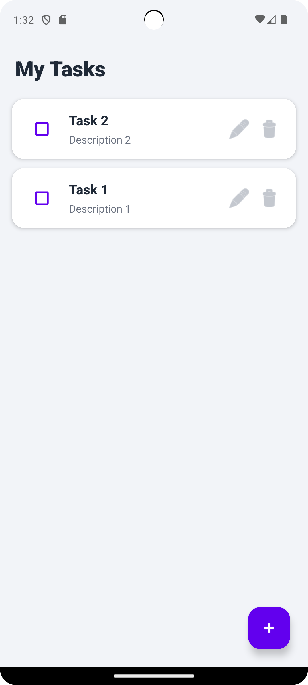

# 📱 Simple Task Manager App  
### Mobile Application Development – Assignment 03 (Mini Project)

---

## 👨‍🎓 Student Details

**Name:** U.M.S. Jayaweera  
**Index No:** 14625  
**Module:** SEN4302 – Mobile Application Development  

---

## 📖 App Description

The **Simple Task Manager App** is an Android application developed to allow users to create, view, manage, and organize personal tasks or notes.

This application demonstrates:

- UI design using Material guidelines  
- Local data persistence  
- State management  
- Basic Android architecture  
- Secure coding awareness  

The app works completely offline and does not require any backend or internet connection.

---

## 🚀 Core Features

- ➕ Add new tasks/notes    
- ✏️ Edit existing tasks  
- ❌ Delete tasks  
- ✅ Mark tasks as completed 

---

## 🛠️ Technologies Used

- **Language:** Kotlin  
- **IDE:** Android Studio  
- **Minimum SDK:** API 26+  
- **Architecture Component:** ViewModel  
- **Data Persistence:** SharedPreferences / Room  

---

## 🖼️ Screenshots

### 🔹 Main Screen – Task List

### 🔹 Validation Check

### 🔹 Completed Task Example

---
